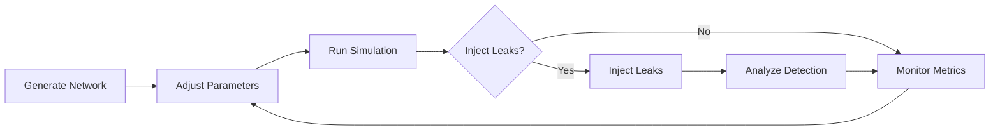

<div align="center">

# ⚡ Bentonville Gas Simulator

### A Real-Time Digital Twin for Gas Distribution Network Analysis

[](https://python.org)
[](https://react.dev)
[](https://fastapi.tiangolo.com)
[](https://typescriptlang.org)
[](https://opensource.org/licenses/MIT)

*Simulate, analyze, and detect leaks in gas distribution networks using real physics.*

[Quick Start](#-quick-start) • [Features](#-features) • [API Reference](#-api-reference) • [Architecture](#-architecture) • [Contributing](#-development)

</div>

---

## 📖 The Story Behind This Project

> *"The best time to prepare for a crisis is before it happens."*

### The Bentonville Incident

On **December 17, 2025**, a wave of alarm swept through Bentonville when a powerful natural gas odor spread across the city. The smell was strong enough to trigger evacuations at **Walmart's Home Office** and **Bentonville High School**—thousands of people displaced out of an abundance of caution.

The culprit? Not a dangerous gas leak, but an excess release of **mercaptan**—the harmless odorant added to odorless natural gas to make leaks detectable. Black Hills Energy had been conducting maintenance on a gas line near J Street and Walton Boulevard, and during the process, too much of the "rotten egg" chemical escaped into the air. Ventilation systems pulled the odor indoors, amplifying the scare. By day's end, officials gave the all-clear.

### Why This Matters

The Bentonville incident ended safely, but it exposed a deeper truth: **growing American cities are under increasing pressure**. Aging infrastructure, intensifying demand, and strained supply chains create vulnerabilities that can manifest anywhere—from Bentonville to Boston.

This simulator was born from a simple question: *How can we leverage technology to understand, predict, and prevent infrastructure failures before they become crises?*

---

## 🌟 Overview

The **Bentonville Gas Simulator** is a sophisticated digital twin that models the gas distribution infrastructure of Bentonville, Arkansas. It combines **Darcy-Weisbach fluid dynamics** with intelligent **graph-based leak detection** to provide real-time insights into network behavior.

Whether you're stress-testing network capacity, training operators on leak scenarios, or planning infrastructure upgrades—this simulator provides the physics-accurate environment you need.

### ✨ Key Highlights

- 🔬 **Physics-Accurate** — Darcy-Weisbach equation with Swamee-Jain friction factor approximation
- ⚡ **Real-Time** — WebSocket-driven updates for instant pressure and flow visualization
- 🔍 **Smart Detection** — Multi-strategy leak detection using pressure deficits, spatial clustering, and graph propagation
- 🎯 **Interactive** — Inject leaks, adjust pressures, and watch the network respond in real-time
- 📊 **Production-Ready** — Modern React + FastAPI stack with optional PostgreSQL persistence

---

## 🚀 Quick Start

Get up and running in under 2 minutes.

### Prerequisites

- Python 3.11+
- Node.js 18+
- Docker (optional, for PostgreSQL)

### Backend Setup

```bash
# Clone and navigate to the project
cd bentonville_gas_simulator

# Create and activate virtual environment
python3 -m venv .venv && source .venv/bin/activate

# Install dependencies
pip install -r requirements.txt

# Launch the API server
uvicorn api.main:app --reload --port 8000
```

🎉 API running at **http://localhost:8000** | Docs at **http://localhost:8000/docs**

### Frontend Setup

```bash
cd frontend
npm install
npm run dev
```

🎉 UI running at **http://localhost:5173**

### Optional: PostgreSQL Persistence

```bash
# Start PostgreSQL via Docker
docker compose up -d

# Initialize the database schema
python scripts/setup_db.py

# Restart API with database enabled
USE_DATABASE=true uvicorn api.main:app --reload --port 8000
```

---

## 🛠️ Features

### 🏗️ Procedural Network Generation

Generate realistic gas distribution networks with configurable parameters:

| Node Type | Distribution | Demand Range |
|-----------|-------------|--------------|
| 🏠 Residential | 70% | 0.5 – 3.0 m³/h |
| 🏢 Commercial | 20% | 5.0 – 50.0 m³/h |
| 🏭 Industrial | 10% | 50.0 – 500.0 m³/h |

The network generator uses a **Random Geometric Graph** algorithm that creates realistic topology with:
- Clustered neighborhoods (simulating urban districts)
- Pseudo-grid snapping (simulating street layouts)
- Hierarchical pipe sizing (main lines → service lines)

### 🔬 Physics Engine

The simulation core implements the **Darcy-Weisbach equation** for accurate pressure drop calculations:

```
ΔP = f × (L/D) × (ρv²/2)
```

| Symbol | Description | Unit |
|--------|-------------|------|
| ΔP | Pressure drop | Pa |
| f | Darcy friction factor | — |
| L | Pipe length | m |
| D | Pipe diameter | m |
| ρ | Gas density | kg/m³ |
| v | Flow velocity | m/s |

**Friction Factor Calculation:**
- **Laminar flow** (Re < 2300): `f = 64/Re`
- **Transition** (2300 ≤ Re < 4000): Linear interpolation
- **Turbulent** (Re ≥ 4000): Swamee-Jain approximation of Colebrook-White

**Natural Gas Properties:**
| Property | Value |
|----------|-------|
| Density | 0.72 kg/m³ |
| Dynamic Viscosity | 1.1 × 10⁻⁵ Pa·s |
| Specific Gravity | 0.60 |
| Compressibility Factor | 0.998 |

### 🔍 Intelligent Leak Detection

The leak detector employs a multi-strategy approach:

1. **Pressure Deficit Analysis** — Compare expected vs. actual pressure at each node
2. **Spatial Clustering** — Group nearby anomalies to identify leak epicenters
3. **Graph Propagation Tracing** — Follow low-pressure paths back to potential sources
4. **Statistical Outlier Detection** — Identify nodes with abnormal pressure signatures

Each detected leak includes:
- 📍 Location coordinates
- 📊 Confidence score (0–100%)
- ⚠️ Severity classification (minor → critical)
- 🔗 Downstream impact analysis
- 💡 Actionable recommendations

### ⚡ Real-Time WebSocket Communication

Bidirectional communication enables instant updates:

```
┌─────────────┐                    ┌─────────────┐
│   React UI  │◄───── WebSocket ────►│  FastAPI   │
└─────────────┘                    └─────────────┘
     │                                    │
     │  SET_PRESSURE ──────────────────►  │
     │  SET_DEMAND_MULTIPLIER ─────────►  │
     │  INJECT_LEAK ───────────────────►  │
     │                                    │
     │  ◄───────── SIMULATION_UPDATE      │
     │  ◄───────── NETWORK_UPDATE         │
     │  ◄───────── LEAK_ALERT             │
     │                                    │
```

---

## 📡 API Reference

### REST Endpoints

| Endpoint | Method | Description |
|----------|--------|-------------|
| `/health` | `GET` | Health check and status |
| `/api/network` | `GET` | Retrieve current network topology |
| `/api/network/generate` | `POST` | Generate a new network |
| `/api/simulate` | `POST` | Run physics simulation |
| `/api/simulation/state` | `GET` | Get current simulation state |
| `/api/leaks/detect` | `POST` | Run leak detection analysis |
| `/api/leaks/inject` | `POST` | Inject test leaks into network |
| `/api/leaks/clear` | `POST` | Clear all active leaks |
| `/api/sensors/optimal` | `POST` | Calculate optimal sensor placement |
| `/ws` | `WebSocket` | Real-time bidirectional updates |

### WebSocket Protocol

**Client → Server Messages:**
```json
{"type": "SET_PRESSURE", "payload": {"value": 500}}
{"type": "SET_DEMAND_MULTIPLIER", "payload": {"value": 1.5}}
{"type": "INJECT_LEAK", "payload": {"count": 2}}
{"type": "CLEAR_LEAKS", "payload": {}}
```

**Server → Client Messages:**
```json
{"type": "SIMULATION_UPDATE", "payload": {"node_pressures": {...}, "pipe_flow_rates": {...}}}
{"type": "NETWORK_UPDATE", "payload": {"nodes": [...], "pipes": [...]}}
{"type": "LEAK_ALERT", "payload": {"injected_node_ids": [42, 87]}}
```

---

## 📁 Architecture

```
bentonville_gas_simulator/
│
├── 🐍 Backend (Python)
│   ├── api/
│   │   ├── main.py            # FastAPI app, routes, WebSocket handler
│   │   ├── schemas.py         # Pydantic request/response models
│   │   ├── state.py           # In-memory application state
│   │   ├── database.py        # SQLAlchemy async configuration
│   │   ├── models.py          # ORM models (Node, Pipe, Leak)
│   │   └── crud.py            # Database operations
│   │
│   ├── city_gen.py            # Procedural network generator
│   ├── physics.py             # Darcy-Weisbach physics engine
│   ├── leak_detector.py       # Multi-strategy leak detection
│   └── app.py                 # Legacy Streamlit interface
│
├── ⚛️ Frontend (React + TypeScript)
│   └── frontend/
│       └── src/
│           ├── App.tsx                    # Main application
│           ├── components/
│           │   ├── NetworkMap.tsx         # Interactive Plotly visualization
│           │   ├── FlowChart.tsx          # Pipe flow rate charts
│           │   ├── PressureHistogram.tsx  # Pressure distribution
│           │   ├── ControlPanel.tsx       # Parameter controls
│           │   ├── LeakDetection.tsx      # Leak analysis panel
│           │   └── StatusBar.tsx          # System metrics
│           ├── hooks/
│           │   ├── useApi.ts              # TanStack Query hooks
│           │   └── useWebSocket.ts        # WebSocket connection
│           └── types/
│               └── index.ts               # TypeScript interfaces
│
├── 🗄️ Database
│   ├── alembic/               # Database migrations
│   ├── docker-compose.yml     # PostgreSQL container
│   └── scripts/setup_db.py    # Schema initialization
│
└── 🧪 Tests
    └── tests/
        ├── test_physics.py
        ├── test_leak_detector.py
        ├── test_city_gen.py
        ├── test_api.py
        └── test_integration.py
```

### Technology Stack

| Layer | Technologies |
|-------|--------------|
| **Frontend** | React 19, TypeScript 5.9, Vite 7, TanStack Query 5, Tailwind CSS 4, Plotly.js, Radix UI, Lucide Icons |
| **Backend** | Python 3.11+, FastAPI 0.109+, Pydantic 2, uvicorn, NetworkX 3, NumPy, Pandas |
| **Real-time** | Native WebSockets |
| **Database** | PostgreSQL 16 (optional), SQLAlchemy 2.0 async, Alembic, asyncpg |
| **DevOps** | Docker Compose, Vercel (frontend), Railway (backend) |

---

## 🎮 Usage Guide

### Dashboard Controls

| Control | Range | Description |
|---------|-------|-------------|
| **Source Pressure** | 200–600 kPa | Main supply pressure from source nodes |
| **Demand Multiplier** | 0.5×–2.0× | Simulate off-peak to peak demand scenarios |
| **Network Size** | 10–200 nodes | Total nodes when generating new networks |

### Simulation Workflow



### Metrics Dashboard

The UI displays real-time metrics including:

- 📊 **Network Overview** — Node/pipe counts, connectivity status
- 🌡️ **Pressure Distribution** — Min/max/average across all nodes
- 💨 **Flow Analysis** — Pipe flow rates and velocities
- 🚨 **Leak Status** — Active leaks with severity indicators
- 🔌 **Connection Status** — WebSocket health indicator

---

## 🗺️ Using Real Coordinates

The simulator supports pluggable coordinate providers. To use real Bentonville GIS data:

```python
from city_gen import CityNetworkGenerator

# Implement the CoordinateProvider protocol
class GeoJSONProvider:
    def __init__(self, geojson_path: str):
        # Load your GeoJSON file
        self.features = load_geojson(geojson_path)
    
    def get_bounds(self):
        # Return (min_x, max_x, min_y, max_y)
        return calculate_bounds(self.features)
    
    def generate_points(self, n: int):
        # Return list of (lon, lat) tuples
        return extract_centroids(self.features, n)

# Use with the generator
provider = GeoJSONProvider("bentonville_buildings.geojson")
generator = CityNetworkGenerator(coordinate_provider=provider)
nodes, pipes, graph = generator.generate_network(n_nodes=200)
```

---

## 🧪 Development

### Running Tests

```bash
# Backend unit tests
pytest tests/ -v

# With coverage report
pytest tests/ --cov=. --cov-report=html

# Run specific test file
pytest tests/test_physics.py -v
```

### Frontend Development

```bash
cd frontend

# Development server with HMR
npm run dev

# Type checking
npx tsc --noEmit

# Linting
npm run lint

# Production build
npm run build
```

### Database Migrations

```bash
# Create a new migration
alembic revision --autogenerate -m "Add new field"

# Apply migrations
alembic upgrade head

# Rollback one migration
alembic downgrade -1
```

---

## 🚢 Deployment

### Frontend (Vercel)

The frontend is configured for Vercel deployment via `vercel.json`:

```bash
cd frontend
vercel --prod
```

### Backend (Railway/Docker)

```bash
# Using Railway CLI
railway up

# Or build Docker image
docker build -t bentonville-gas-api .
docker run -p 8000:8000 bentonville-gas-api
```

### Environment Variables

| Variable | Description | Default |
|----------|-------------|---------|
| `USE_DATABASE` | Enable PostgreSQL persistence | `false` |
| `DATABASE_URL` | PostgreSQL connection string | — |
| `ALLOWED_ORIGINS` | CORS allowed origins (comma-separated) | localhost |

---

## 🎯 What This Project Provides

This simulator provides:

- 🎓 **Training Tool** — Help operators understand network dynamics
- 🔬 **Research Platform** — Test leak detection algorithms
- 📐 **Planning Aid** — Model infrastructure upgrades before implementation
- 🚨 **Emergency Preparedness** — Simulate failure scenarios safely

The codebase evolved from a Streamlit prototype to a production-ready React + FastAPI architecture, enabling:
- Real-time collaboration via WebSockets
- Horizontal scaling with async Python
- Type-safe frontend development
- Optional data persistence for historical analysis

---

## 📄 License

This project is licensed under the **MIT License** — see the [LICENSE](LICENSE) file for details.

---

## 🤝 Acknowledgments

- **Darcy-Weisbach Equation** — The foundation of fluid mechanics since 1845
- **NetworkX** — Powerful graph algorithms for Python
- **FastAPI** — Modern, fast web framework for building APIs
- **Plotly** — Interactive visualization that brings data to life

---

<div align="center">

**Built with ❤️ for safer infrastructure**

*Star ⭐ this repo if you find it useful!*

</div>
