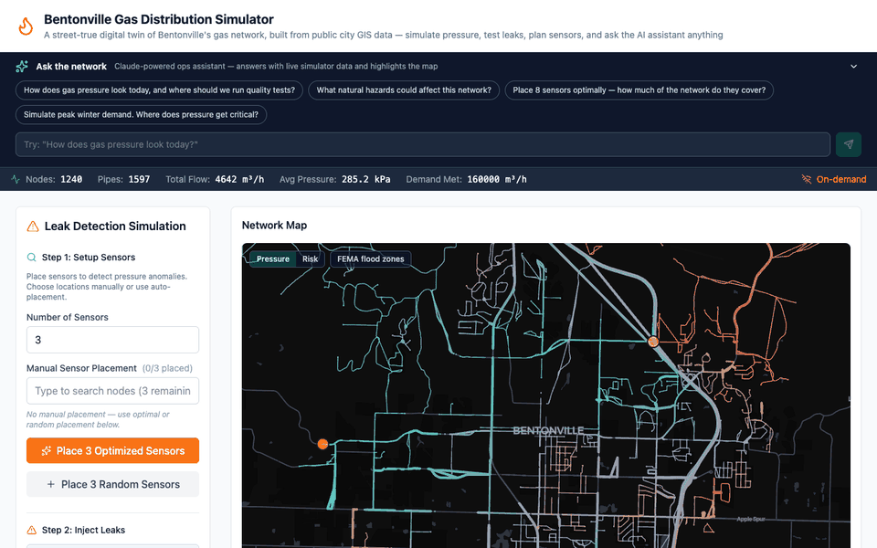

<div align="center">

# Bentonville Gas Simulator

### A street-true digital twin of Bentonville, Arkansas — built from public data, operated by an AI agent

**[Live demo →](https://bentonville-gas-sim.vercel.app)**



*Ask "where should we run quality tests?" — Claude queries the simulator, ranks pipes by
engineering risk, and highlights its answer on the map.*

</div>

---

## What this is

A gas-distribution digital twin whose **1,240 nodes and 1,597 pipes follow Bentonville's real
streets**, with demand derived from real land use and address density, pipe vintage informed by
Census housing age, and real FEMA flood exposure — plus the physics, risk analytics, and
sensor-placement math to do something useful with it.

Three things to try on the [live site](https://bentonville-gas-sim.vercel.app):

1. **Ask the network.** The chat bar is a Claude agent with eight tools over the live simulator.
   It answers operational questions with real computed numbers and highlights the pipes it cites
   on the map.
2. **Flip the map to Risk.** Every pipe is scored `risk = P(fail) × consequence` — the red
   corridors are old steel under heavy traffic that would isolate hundreds of m³/h if they failed.
3. **Drag the sensor budget slider.** A greedy submodular optimizer plans sensor placement
   against 200 physics-simulated leak scenarios and draws the marginal-gain curve:
   **8 sensors detect 75% of leak scenarios vs 34% for random placement.**

> **Synthetic but street-true.** Real gas distribution maps are non-public for security, so this
> network is a plausible reconstruction on real streets — not utility as-builts. It is a
> planning/simulation demo, not an operational tool. Before any real digging: call 811.

## The data (all public, pulled by `etl/`)

| Source | What it provides |
|---|---|
| [City of Bentonville GIS](https://gis.bentonvillear.com/arcgis/rest/services) — street centerlines | Network topology: mains follow real streets, hierarchy from speed/lanes |
| City GIS — Land Use 2025 + address points | Nodal demand (residential/commercial/industrial × density) |
| City GIS — FEMA flood layers (March 2022) | 100-yr / 500-yr flood exposure per pipe + map overlay |
| ARDOT traffic counts | Excavation-strike risk proxy (the leading cause of distribution damage) |
| US Census ACS (block groups) | Median year built → pipe vintage prior; population |
| PHMSA NPMS (manual reference) | Approximate city-gate locations near real transmission corridors |

The ETL runs once (`python -m etl.fetch && python -m etl.build_network`) and commits versioned
artifacts — the deployed app never calls city servers.

## The math

**Risk engine** ([risk.py](risk.py)) — per-pipe `risk = P(fail) × consequence`, percentile-normalized
with full factor breakdowns:

- `P(fail)`: material/age prior (PHMSA incident patterns) × flood exposure × excavation intensity
  × pressure utilization
- `Consequence`: demand isolated if the pipe fails (graph bridges), flow carried, edge
  betweenness, proximity to critical facilities

**Sensor placement** ([placement.py](placement.py)) — 200 risk-weighted leaks are simulated through
the physics engine to build a leak-signature matrix (which sensors would *physically* see which
leaks, at a 2 kPa detection floor). Weighted max-coverage over that matrix is monotone submodular,
so greedy selection is (1−1/e)-optimal — and fast enough to re-plan live as the budget slider moves.

**Physics** ([physics.py](physics.py)) — Darcy-Weisbach pressure drops (Swamee-Jain friction),
iterative network solve, and a hop-decayed leak influence field so leaks depress their hydraulic
neighborhood the way real ones do.

## The agent

`POST /api/agent` streams SSE while Claude (Opus 4.8) runs a tool-use loop over the same services
the UI uses:

| Tool | What it computes |
|---|---|
| `get_network_status` | Pressure distribution, threshold violations, active leaks, warnings |
| `list_inspection_candidates` | Risk-engine ranking with factor breakdowns |
| `run_scenario` | Re-simulate at a different gate pressure / demand multiplier |
| `inject_leaks` / `clear_leaks` / `detect_leaks` | Training scenarios + sensor-based detection |
| `place_sensors` | Submodular plan + marginal-gain curve |
| `get_hazard_context` | Flood exposure, pipe-age profile, regional hazards (tornado/hail/karst) |

Tool results carry node/pipe ids; the frontend pulses the cited locations on the map.

## Architecture

```
React 19 + Vite + MapLibre/deck.gl ──► FastAPI + NetworkX/NumPy ──► Claude API
        (Vercel, static)                (Vercel Python function)
                                          ▲
   committed artifacts:  data/network.json, leak_signatures.npz, overlays/
   built offline by:     etl/fetch.py → etl/build_network.py → etl/build_signatures.py
```

## Run it locally

```sh
# backend — http://localhost:8000 (docs at /docs)
python3 -m venv .venv && source .venv/bin/activate
pip install -r requirements-dev.txt
uvicorn api.main:app --reload --port 8000

# frontend — http://localhost:5173 (proxies /api and /ws to :8000)
cd frontend && npm install && npm run dev
```

Optional: `ANTHROPIC_API_KEY` in `.env` enables the chat agent; `CENSUS_API_KEY` upgrades pipe
vintages from real ACS data on the next ETL run.

```sh
# rebuild artifacts from the raw sources
python -m etl.fetch && python -m etl.build_network && python -m etl.build_signatures

# tests (159 backend + 32 frontend)
pytest tests/ -q
cd frontend && npm test
```

## Deploy

Both halves run on Vercel: the frontend as a static Vite build with `/api/*` rewritten to the
backend project, the FastAPI backend as a Python function (`scripts/deploy_backend.sh`).
WebSockets aren't available on serverless, so the app falls back to REST automatically
("On-demand" in the status bar). The agent endpoint is rate-limited as a cost guard.

## Origin

Born from the **December 17, 2025 Bentonville mercaptan incident** — a gas-odor scare that
evacuated Walmart's Home Office and Bentonville High School and turned out to be an odorant
release during line maintenance near J St & Walton Blvd. The question it left behind: *how would
a growing city see a real problem coming?* This project is one answer: public data + physics +
optimization + an agent that makes all of it conversational.

## License

MIT
